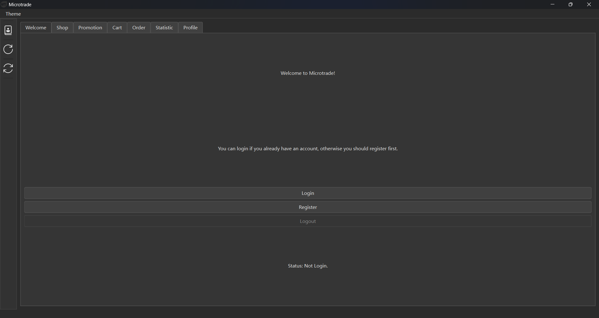
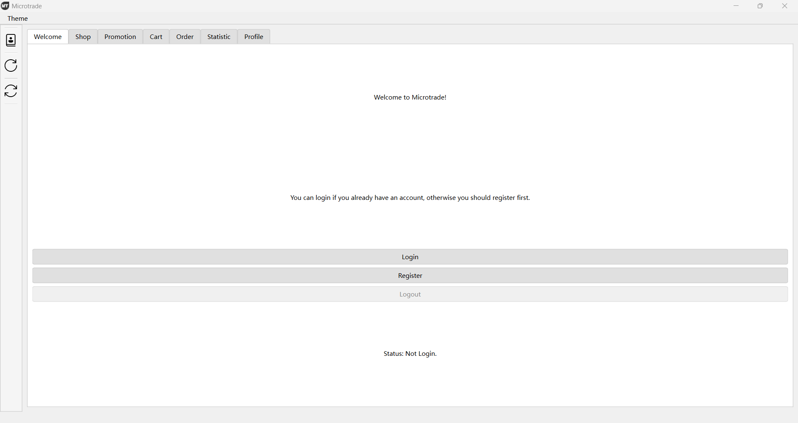
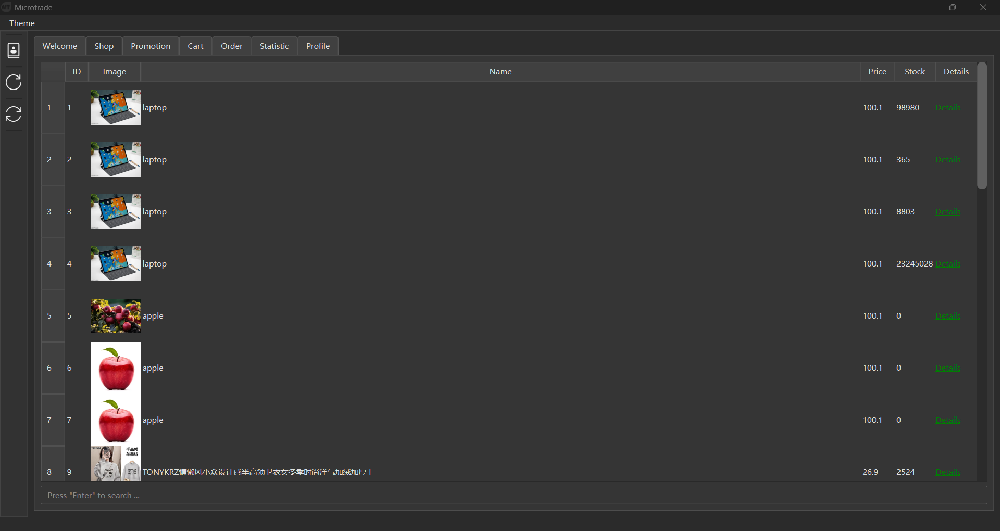
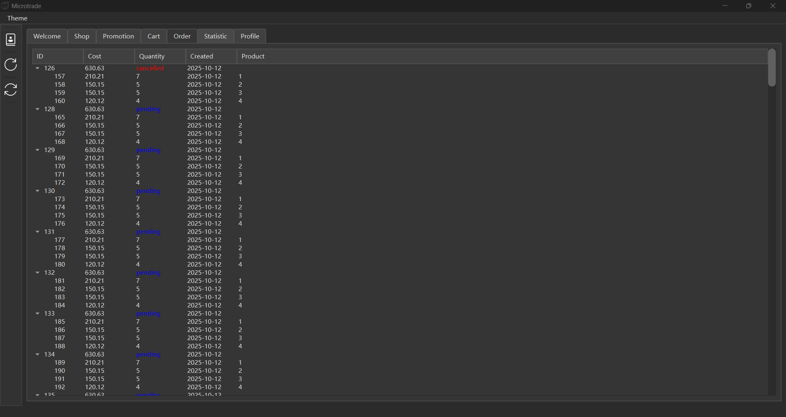
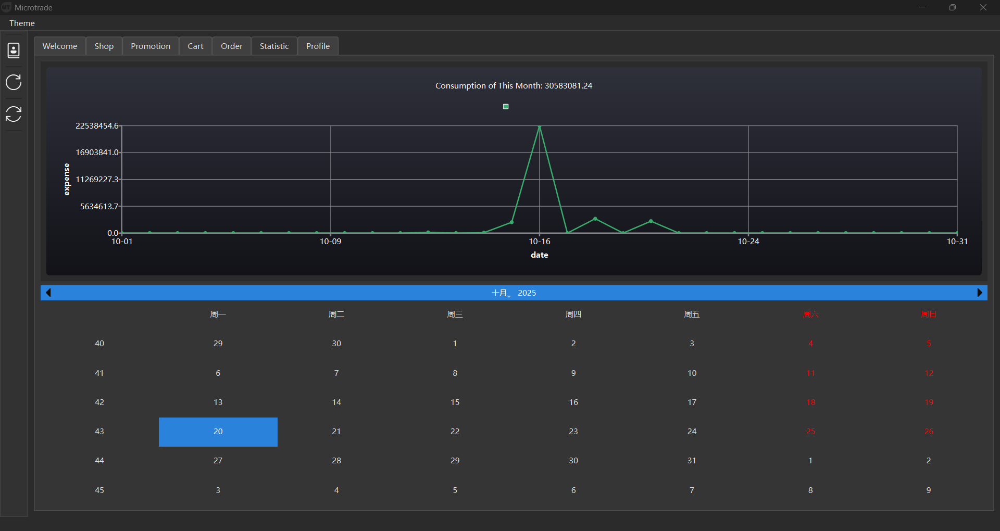

# Microtrade 应用程序综合报告

## 一、需求分析

### （1）系统功能描述

Microtrade 是一个基于 Qt 框架开发的小型贸易应用程序，包含客户端和服务器端组件，主要功能如下：

- 用户认证：支持用户注册、登录和注销功能
- 商品管理：提供商品浏览、详情查看及相关促销信息展示
- 购物车操作：支持将商品添加到购物车及购物车数据管理
- 订单管理：包含订单创建、查看、取消和删除等功能
- 数据同步：确保客户端与服务器之间的数据一致性
- 消费统计：提供用户月度消费统计图表展示功能
- 主题切换：支持明暗两种主题模式，提升用户体验

### （2）重点难点分析

- **数据同步机制**：确保客户端与服务器数据一致性，特别是在网络不稳定情况下的同步策略
- **网络通信可靠性**：基于 TCP 协议实现稳定的客户端-服务器通信，处理连接超时、异常断开等情况
- **并发处理**：服务器需要处理多个客户端的并发请求，保证数据操作的线程安全
- **用户体验优化**：在网络请求过程中保持界面响应性，避免卡顿现象
- **数据安全性**：用户认证信息的安全传输与存储，防止敏感信息泄露

### （3）技术难点说明

- **异步通信处理**：客户端与服务器的异步通信需要合理设计回调机制，确保 UI 线程不被阻塞
- **数据库事务管理**：涉及多表操作时（如创建订单同时更新库存），需要保证事务的原子性
- **状态同步**：全局状态管理（Commander 类）需要准确同步用户登录状态、数据更新等事件
- **跨线程数据交互**：网络请求线程与 UI 线程之间的安全数据传递，避免竞态条件
- **数据格式解析**：JSON 数据与 C++ 对象之间的高效转换及错误处理

## 二、设计

### （1）功能模块划分

系统采用客户端-服务器架构，主要模块划分如下：

**客户端模块**：

- 界面模块：包含主窗口、欢迎界面、登录/注册对话框、商品详情对话框、订单管理界面等
- 网络模块：封装 TCP 通信功能，实现与服务器的数据交互
- 状态管理模块：通过 Commander 类实现全局状态管理和事件通知
- 数据处理模块：负责 JSON 数据解析与对象转换
- 配置模块：处理客户端配置文件的读取与写入

**服务器模块**：

- 网络服务模块：基于 TCP 协议的服务器实现，处理客户端连接与请求
- 数据库操作模块：封装数据库访问接口，实现数据的 CRUD 操作
- 业务逻辑模块：处理订单创建、商品管理等核心业务逻辑
- 配置模块：处理服务器配置文件的读取与写入

**共享模块**：

- 实体类模块：定义商品、订单、用户等数据实体
- 通信协议模块：定义客户端与服务器之间的通信格式与规则

### （2）类图及说明

```


```plantuml
@startuml

' 基础实体类
class Entity {
  + Entity()
  + Entity(id: qint64, createdAt: QDateTime, removedAt: QDateTime)
  + fromJson(json: QJsonObject): Entity
  + toJson(): QJsonObject
  # initFromJson(json: QJsonObject)
  - m_id: qint64
  - m_createdAt: QDateTime
  - m_removedAt: QDateTime
}

' 数据实体类
class User extends Entity {
  + User()
  + User(id: qint64, createdAt: QDateTime, removedAt: QDateTime, username: QString, passwordHash: QString, avatarUrl: QUrl)
  + fromJson(json: QJsonObject): User
  + toJson(): QJsonObject
  + username(): QString
  + passwordHash(): QString
  + avatarUrl(): QUrl
  # initFromJson(json: QJsonObject)
  - m_username: QString
  - m_passwordHash: QString
  - m_avatarUrl: QUrl
}

class Product extends Entity {
  + enum Category { Null, Food, Clothes, Furniture, Tool, Electronic }
  + Product()
  + Product(id: qint64, createdAt: QDateTime, removedAt: QDateTime, name: QString, description: QString, price: double, stock: qint64, category: Category, imageUrl: QUrl)
  + fromJson(json: QJsonObject): Product
  + toJson(): QJsonObject
  + categoryToString(category: Category): QString
  + stringToCategory(str: QString): Category
  + name(): QString
  + description(): QString
  + price(): double
  + stock(): qint64
  + category(): Category
  + imageUrl(): QUrl
  # initFromJson(json: QJsonObject)
  - m_name: QString
  - m_description: QString
  - m_price: double
  - m_stock: qint64
  - m_category: Category
  - m_imageUrl: QUrl
}

class Order extends Entity {
  + enum Status { Null, Pending, Cancelled, Accepted, Unaccepted, Returned }
  + Order()
  + Order(id: qint64, createdAt: QDateTime, removedAt: QDateTime, userId: qint64, cost: double, status: Status)
  + fromJson(json: QJsonObject): Order
  + toJson(): QJsonObject
  + statusToString(status: Status): QString
  + stringToStatus(str: QString): Status
  + userId(): qint64
  + cost(): double
  + status(): Status
  # initFromJson(json: QJsonObject)
  - m_userId: qint64
  - m_cost: double
  - m_status: Status
}

class OrderItem extends Entity {
  + OrderItem()
  + fromJson(json: QJsonObject): OrderItem
  + toJson(): QJsonObject
  + productId(): qint64
  + quantity(): qint64
  + cost(): double
  # initFromJson(json: QJsonObject)
  - m_productId: qint64
  - m_quantity: qint64
  - m_cost: double
}

class CartItem {
  - m_id: qint64
  - m_productId: qint64
  - m_quantity: qint64
}

' 客户端核心类
class MainWindow extends QMainWindow {
  + MainWindow(parent: QWidget)
  - setupMenuTheme()
  - applyLightTheme()
  - applyDarkTheme()
  - ui: Ui::MainWindow
}

class Commander {
  + instance(): Commander
  + isDarkTheme(): bool
  + logout()
  + privateUpdate()
  + synchronous()
  + synchronoused()
  signals:
    + loggedin()
    + loggedout()
    + privateUpdated()
    + readySetDarkTheme()
    + readySetLightTheme()
}

' 客户端界面组件
class WelcomeWidget extends QWidget {
  + WelcomeWidget(parent: QWidget)
  - onLoginPushButtonClicked()
  - onRegisterPushButtonClicked()
  - onLogoutPushButtonClicked()
  - tryToLogout()
  - onLogoutClientReadyRead(response: TcpResponse)
  - onCommanderLogin()
  - onCommanderLogout()
  - ui: Ui::WelcomeWidget
}

class UserCenterWidget extends QWidget {
  + UserCenterWidget(parent: QWidget)
  + setClient(client: My::TcpClient)
  + setUserId(userId: int)
  + refresh()
  signals:
    + readySetUserId(userId: int)
  - on_pushButtonLogin_clicked()
  - on_pushButtonRegister_clicked()
  - on_pushButtonLogout_clicked()
  - on_pushButtonUnregister_clicked()
  - ui: Ui::UserCenterWidget
  - client: My::TcpClient
  - userId: int
}

class ProfileWidget extends QWidget {
  + ProfileWidget(parent: QWidget)
  + update()
  + clear()
  + setUser(user: User)
  - onUserClientReadyRead(response: TcpResponse)
  - onUsernameAlterPushButtonClicked()
  - onPasswordResetPushButtonClicked()
  - setUserName(username: QString)
  - ui: Ui::ProfileWidget
}

class OrderWidget extends QWidget {
  + OrderWidget(parent: QWidget)
  + update()
  - onOrderClientReadyRead(response: TcpResponse)
  - onTreeWidgetCustomContextMenuRequested(pos: QPoint)
  - onCancelOrderTriggered()
  - onCancelOrderClientReadyRead(response: TcpResponse)
  - onDeleteOrderTriggered()
  - onDeleteOrderClientReadyRead(response: TcpResponse)
  - ui: Ui::OrderWidget
  - currentOrderItem: QTreeWidgetItem
  - productIdMap: QMap<QTreeWidgetItem*, qint64>
  - orderIdMap: QMap<QTreeWidgetItem*, qint64>
}

class CartWidget extends QWidget {
  + CartWidget(parent: QWidget)
  + update()
  + clear()
  - onCartProductListClientReadyRead(response: TcpResponse)
  - onPayPushButtonClicked()
  - onCartSyncClientReadyRead(response: TcpResponse)
  - sendPaymentRequest(response: TcpResponse)
  - onPaymentClientReadyRead(response: TcpResponse)
  - onCommanderSynchronoused()
  - onItemDoubleClicked(item: QTableWidgetItem)
  - setProduct(row: int, product: Product, quantity: qint64)
  - setProductId(row: int, productId: qint64)
  - setImage(row: int, imageUrl: QUrl)
  - setName(row: int, productName: QString)
  - setPrice(row: int, price: double)
  - setStock(row: int, stock: qint64)
  - setQuantity(row: int, quantity: qint64)
  - setRemove(row: int, productId: qint64)
  - ui: Ui::CartWidget
  - productIdList: QList<qint64>
}

class StatisticWidget extends QWidget {
  + StatisticWidget(parent: QWidget)
  + clearChart()
  + updateChart()
  - readyUpdateChart(response: TcpResponse)
  - ui: Ui::StatisticWidget
}

' 对话框类
class LoginDialog extends QDialog {
  + LoginDialog(parent: QWidget)
  + setClient(client: My::TcpClient)
  signals:
    + readySetUserId(userId: int)
}

class RegisterDialog extends QDialog {
  + RegisterDialog(parent: QWidget)
  + setClient(client: My::TcpClient)
}

class ProductDialog extends QDialog {
  + ProductDialog(parent: QWidget)
  + setProductId(id: qint64)
  + update()
}

class UsernameAlterDialog extends QDialog {
  + UsernameAlterDialog(parent: QWidget)
  + setOldUsername(username: QString)
  signals:
    + altered()
}

class PasswordResetDialog extends QDialog {
  + PasswordResetDialog(parent: QWidget)
  signals:
    + reseted()
}

' 网络通信类
class TcpLocalClient {
  + sendAsync()
  signals:
    + readyRead(response: TcpResponse)
    + timeout()
}

class TcpUserClient extends TcpLocalClient {
  + sendAsync()
}

class TcpOrderClient extends TcpLocalClient {
  + sendAsync()
}

class TcpCancelOrderClient extends TcpLocalClient {
  + sendAsync(orderId: qint64)
}

class TcpDeleteOrderClient extends TcpLocalClient {
  + sendAsync(orderId: qint64)
}

class TcpCartProductListClient extends TcpLocalClient {
  + sendAsync()
}

class TcpCartSyncClient extends TcpLocalClient {
  + sendAsync(cartItemList: QList<CartItem>)
}

class TcpPaymentClient extends TcpLocalClient {
  + sendAsync()
}

class TcpRemoveFromCartClient extends TcpLocalClient {
  + sendAsync(productId: qint64)
}

class TcpLogoutClient extends TcpLocalClient {
  + sendAsync()
}

class TcpMonthDailyCostClient extends TcpLocalClient {
  + sendAsync(year: int, month: int)
}

class TcpResponse {
  + success(): bool
  + body(): QJsonObject
  + statusDetail(): QString
  + statusType(): StatusType
  enum StatusType { Failed }
}

' 关系定义
Entity <|-- User
Entity <|-- Product
Entity <|-- Order
Entity <|-- OrderItem

Commander --> MainWindow: 通知主题变更
Commander --> WelcomeWidget: 通知登录状态
Commander --> ProfileWidget: 通知数据更新
Commander --> OrderWidget: 通知数据更新
Commander --> CartWidget: 通知数据更新
Commander --> StatisticWidget: 通知数据更新

MainWindow *-- Ui::MainWindow
WelcomeWidget *-- Ui::WelcomeWidget
UserCenterWidget *-- Ui::UserCenterWidget
ProfileWidget *-- Ui::ProfileWidget
OrderWidget *-- Ui::OrderWidget
CartWidget *-- Ui::CartWidget
StatisticWidget *-- Ui::StatisticWidget

WelcomeWidget --> LoginDialog: 打开
WelcomeWidget --> RegisterDialog: 打开
WelcomeWidget --> TcpLogoutClient: 使用

UserCenterWidget --> LoginDialog: 打开
UserCenterWidget --> RegisterDialog: 打开
UserCenterWidget --> My::TcpClient: 使用

ProfileWidget --> TcpUserClient: 使用
ProfileWidget --> UsernameAlterDialog: 打开
ProfileWidget --> PasswordResetDialog: 打开

OrderWidget --> TcpOrderClient: 使用
OrderWidget --> TcpCancelOrderClient: 使用
OrderWidget --> TcpDeleteOrderClient: 使用
OrderWidget --> ProductDialog: 打开

CartWidget --> TcpCartProductListClient: 使用
CartWidget --> TcpCartSyncClient: 使用
CartWidget --> TcpPaymentClient: 使用
CartWidget --> TcpRemoveFromCartClient: 使用
CartWidget --> ProductDialog: 打开

StatisticWidget --> TcpMonthDailyCostClient: 使用

@enduml
```

### （3）数据库定义

系统采用 SQLite 数据库，主要表结构如下：

- `users`：存储用户信息，包括用户名、密码哈希、头像 URL 等
- `products`：存储商品信息，包括名称、描述、价格、库存等
- `promotions`：存储促销信息，包括描述、开始/结束时间、优惠策略等
- `product_promotion_relations`：商品与促销的关联表
- `orders`：存储订单信息，包括用户 ID、总金额、状态等
- `order_items`：存储订单项信息，包括订单 ID、商品 ID、数量、单价等

关键表设计示例：

```sql
CREATE TABLE IF NOT EXISTS orders (
    id         INTEGER,
    created_at DATETIME        NOT NULL DEFAULT CURRENT_TIMESTAMP,
    removed_at DATETIME,
    user_id    INTEGER         NOT NULL,
    cost       DECIMAL (10, 2) NOT NULL,
    status     TEXT            NOT NULL,
    PRIMARY KEY (id)
);

CREATE TABLE IF NOT EXISTS products (
    id          INTEGER,
    created_at  DATETIME        NOT NULL DEFAULT CURRENT_TIMESTAMP,
    removed_at  DATETIME,
    name        TEXT            NOT NULL,
    description TEXT,
    price       DECIMAL (10, 2) NOT NULL,
    stock       INTEGER         NOT NULL,
    category    TEXT,
    image_url   TEXT,
    PRIMARY KEY (id)
);
```

### （4）UI设计

UI 设计遵循 Qt 的 MVC 模式，主要特点：

- 采用主窗口 + 多子界面的结构，通过菜单和工具栏实现导航
- 支持明暗两种主题切换，提升不同光线环境下的使用体验
- 数据展示采用表格（QTableWidget）和树形控件（QTreeWidget），清晰呈现层级关系
- 交互反馈：操作结果通过消息框（QMessageBox）提示，网络请求过程中保持界面响应
- 图表展示：使用 Qt Charts 组件展示消费统计数据，直观呈现用户消费趋势

### （5）协议设计

- **通信方式**：基于 TCP 协议的客户端-服务器通信
- **数据格式**：采用 JSON 格式进行数据交换，包含请求/响应头和消息体
- **请求结构**：包含操作类型、用户认证信息、请求参数等
- **响应结构**：包含状态码、状态描述、响应数据等
- **异步处理**：客户端发送请求后不阻塞，通过信号槽机制处理服务器响应

示例响应处理：

```cpp
void OrderWidget::onOrderClientReadyRead(const TcpResponse &response) {
    if (response.success()) {
        QJsonObject body = response.body();
        QJsonArray orderTree = body["orderTree"].toArray();
        // 解析并展示订单数据
    }
}
```

### （6）设计模式使用

- **单例模式**：`Commander` 类采用单例模式，确保全局只有一个状态管理器实例
- **观察者模式**：通过 Qt 的信号与槽机制实现，如 `Commander` 发送事件通知，各组件响应更新
- **MVC 模式**：分离数据（实体类）、视图（Widget）和控制器（业务逻辑）
- **工厂模式**：各种 TcpClient 类封装不同类型的网络请求，提供统一接口
- **策略模式**：促销策略的设计中使用，支持不同类型的折扣计算方式

## 三、实现

### （1）编译环境

- 开发框架：Qt 5 及以上版本
- 编译器：支持 C++11 及以上标准的 C++ 编译器
- 数据库：SQLite
- 构建工具：Qt Creator
- 操作系统：跨平台支持（Windows、Linux、macOS）

### （2）核心流程

1. **用户登录流程**：

   - 客户端展示登录界面，用户输入凭据
   - 客户端发送登录请求到服务器
   - 服务器验证凭据，返回验证结果
   - 客户端根据结果更新登录状态，同步用户数据
2. **订单创建流程**：

   - 用户在购物车中确认商品，提交订单
   - 客户端发送订单创建请求
   - 服务器验证库存，创建订单记录和订单项记录
   - 服务器返回订单创建结果
   - 客户端更新订单列表
3. **数据同步流程**：

   - 客户端触发同步请求（手动或自动）
   - 服务器返回最新数据
   - 客户端更新本地缓存和界面展示

### （3）核心方法

1. **订单管理核心方法**：

```cpp
// 订单数据更新
void OrderWidget::update() {
    TcpOrderClient *orderClient = new TcpOrderClient(this);
    connect(orderClient, &TcpOrderClient::readyRead, this,
            &OrderWidget::onOrderClientReadyRead);
    orderClient->sendAsync();
}

// 取消订单处理
void OrderWidget::onCancelOrderTriggered() {
    // 确认对话框 + 发送取消请求 + 处理响应
}
```

2. **商品详情与购物车操作**：

```cpp
// 添加到购物车
void ProductDialog::onAddToCartPushButtonClicked() {
    TcpAddToCartClient *addToCartClient = new TcpAddToCartClient(this);
    connect(addToCartClient, &TcpProductClient::readyRead, this,
            &ProductDialog::onAddToCartClientReadyRead);
    addToCartClient->sendAsync(m_productId);
}
```

3. **消费统计生成**：

```cpp
// 服务器端生成月度消费统计
QJsonArray SqlMonthDailyCostServer::exec(qint64 userId, int year, int month) {
    // SQL 查询 + 结果封装为 JSON
}

// 客户端展示统计图表
void StatisticWidget::readyUpdateChart(const TcpResponse &response) {
    // 解析数据 + 生成图表
}
```

### （4）核心功能实现

1. **用户认证**：通过 `LoginDialog` 和 `RegisterDialog` 实现，密码以哈希形式存储
2. **商品浏览与详情**：`ProductDialog` 展示商品信息及相关促销，支持添加到购物车
3. **订单管理**：`OrderWidget` 提供订单列表展示、取消和删除功能，支持右键菜单操作
4. **消费统计**：`StatisticWidget` 使用 Qt Charts 绘制月度消费趋势图，支持交互
5. **主题切换**：`MainWindow` 实现明暗主题切换，适应不同使用环境

## 四、相关技术讨论

### （1）持久层使用

- 服务器端采用直接 SQL 操作方式，通过 `QSqlQuery` 执行数据库操作
- 客户端采用内存缓存 + 服务器同步的方式，减少数据库直接操作
- 使用参数化查询防止 SQL 注入攻击
- 通过 `removed_at` 字段实现逻辑删除，保留数据历史

### （2）SQL

- 使用聚合函数（如 SUM）进行统计数据计算
- 通过日期范围查询实现按时间维度的数据筛选
- 使用事务确保多表操作的原子性（如创建订单时同步扣减库存）
- 合理设计索引提升查询性能（如 `idx_cart_items_unique_active`）

### （3）多线程

- 服务器端使用线程池处理多个客户端连接，提高并发处理能力
- 客户端网络请求在独立线程中执行，避免阻塞 UI 线程
- 通过 Qt 的信号槽机制实现线程间通信，确保数据安全传递
- 使用 `QMetaObject::invokeMethod` 在 UI 线程中更新界面

### （4）容器的使用

- 使用 `QJsonArray` 和 `QJsonObject` 处理 JSON 数据
- 使用 `QMap` 存储控件与数据 ID 的映射关系（如 `orderIdMap`）
- 使用 `QVector` 存储临时数据列表，便于遍历和处理
- 使用 Qt 容器类的线程安全性，确保多线程环境下的数据访问安全

## 五、难点问题讨论

1. **异步通信与 UI 同步**

   - 问题：网络请求为异步操作，如何确保数据返回后正确更新 UI
   - 解决方案：使用 Qt 的信号槽机制，配合 `Qt::QueuedConnection` 确保在 UI 线程中处理结果
2. **数据一致性维护**

   - 问题：多客户端同时操作可能导致数据不一致
   - 解决方案：服务器端使用数据库事务和锁机制，确保并发操作的数据一致性
3. **网络异常处理**

   - 问题：网络不稳定导致请求超时或失败
   - 解决方案：实现超时重连机制，操作失败时给予用户明确提示，并提供重试选项
4. **大量数据展示优化**

   - 问题：订单或商品数据过多时，界面加载缓慢
   - 解决方案：实现分页加载机制，只加载当前视图所需数据，提升响应速度

## 六、收获和展望

### 收获

- 掌握了 Qt 框架下客户端-服务器应用的设计与实现
- 深入理解了 TCP 网络通信和 JSON 数据交换的实际应用
- 实践了 MVC 模式和多种设计模式在实际项目中的应用
- 提升了处理多线程、异步操作等复杂场景的能力
- 学习了数据库设计与优化的基本方法

### 展望

1. **功能扩展**：

   - 增加商品搜索和筛选功能
   - 实现更复杂的促销策略和优惠券系统
   - 添加用户评价和商品评分功能
2. **性能优化**：

   - 实现数据缓存机制，减少网络请求
   - 优化数据库查询，提升大数据量下的响应速度
   - 引入数据压缩，减少网络传输量
3. **技术升级**：

   - 考虑使用 RESTful API 或 WebSocket 替代部分 TCP 通信
   - 引入 ORM 框架简化数据库操作
   - 增加单元测试和集成测试，提高代码质量
4. **用户体验提升**：

   - 实现更丰富的图表和数据可视化功能
   - 增加操作引导和帮助系统
   - 优化移动设备适配，支持更多平台

Microtrade 应用程序通过合理的架构设计和技术选型，实现了小型贸易系统的核心功能，为后续扩展奠定了坚实基础。
