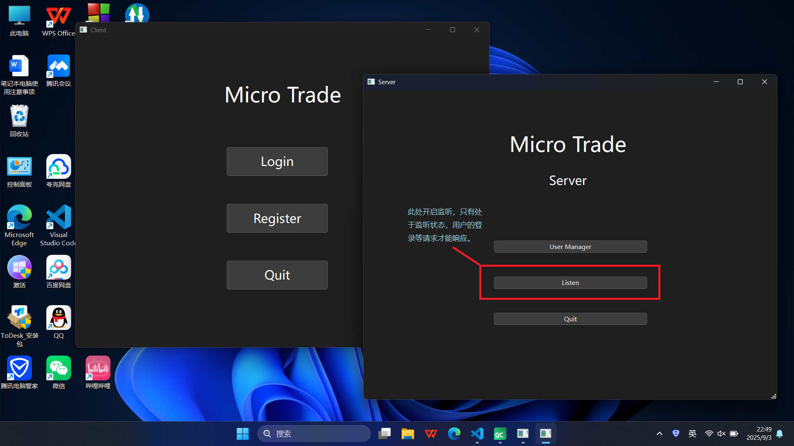
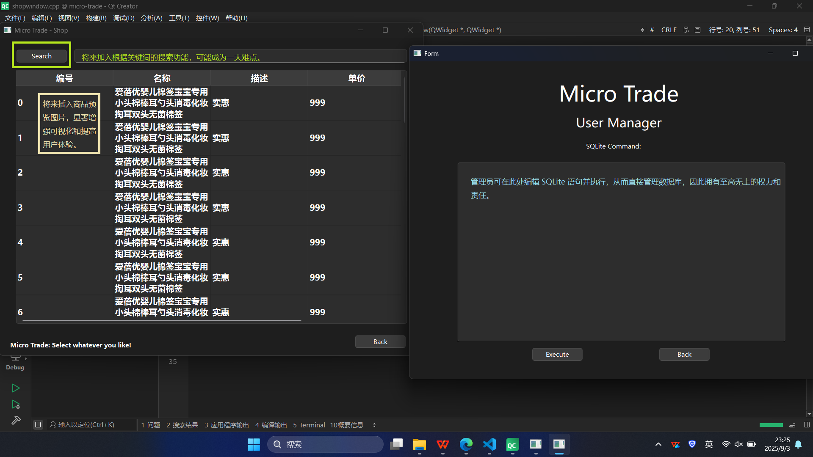

# 关于微商系统的项目报告（一）

## 一、项目的需求描述

### 1、功能需求

#### （1）业务逻辑
| 对象 | 描述 |
|----|----|
| 客户端 | 打开应用后，用户首先进入登录/注册界面。如果已注册，则可输入账号密码并提交登录请求，由服务器处理并响应，否则需注册。登录后进入主菜单，主要包括浏览商品和查看个人中心。商品界面中，用户可选择搜索、查看、购买、退回、收藏（相当于加入购物车，参考了拼多多）商品。个人中心中，用户可查看余额，或对收藏夹中的商品进行快捷操作。 |
| 服务器 | 对用户的登录、注册、注销、购买、退货等进行处理和响应，通过数据库把商品数据发送到客户端，以便用户操作商品。 |

#### （2）UI 描述
采用 Qt 的设计师界面，多窗口模式。



#### （3）通信
采用 Tcp 网络协议，用 Qt 中的 QTcp 类实现。采用 json 文件格式传输数据，其中含有唯一关键键 type，用于辨识消息类型，其余数据均为键值对形式。

### 2、性能需求

#### （1）多层结构
- 网络通信：C/S 结构。
- 客户端：面向用户的 UI 层，后台处理事务的业务层。
- 服务器：面向管理员的 UI 层，后台处理事务的业务层，用于操作数据的数据库持久层。
```
    client                      server                     database
┌───────────┐               ┌───────────┐               ┌───────────┐
│    UI     │     user      │    UI     │     admin     │    UI     │
│   layer   │   operating   │   layer   │   operating   │   layer   │
│           │               │           │               │           │
├───────────┤               ├───────────┤               ├───────────┤
│ business  │  handling     │ business  │  handling     │  durable  │
│   layer   │    users      │   layer   │  operations   │   layer   │
│           │  operation    │           │  and requests │           │
└───────────┘               └───────────┘               │           │
        |                         |                     └───────────┘
        └───────── TCP/IP  ───────┘                       |
                                                          │
                                                          │
                                                  read data from the database
```

#### （2）柔性讨论
用户、商品等对象的属性不是一成不变的，例如商品的价格会随着促销活动、用户等级、优惠券等改变，设计时需要长远考虑，预留一些接口等。

#### （3）扩展能力
项目初期会实现浏览、购买、结算等简单功能，后续需要添加退货、收藏等更多功能时，在不改变原有架构的前提下，使用多态等特性对代码进行扩展。

## 二、相关技术
Qt API、TCP 协议、数据库连接、大数据预测。不熟悉的可以跟随视频、博客学习，学习周期可以接受。

## 三、关于设计的初步思考
先从客户端和简单功能入手，搭建整个项目框架，后续再进行服务器、通信和数据库的功能填充。由小及大，由简入繁，逐步扩展整个项目，有利于开发过程的顺利进行。

## 四、难度预估
具有网络通信、数据库连接、多线程调度等基础功能，能统计用户账单、商家盈利，支持促销等事件，能根据用户使用记录进行简单推荐等。
原因：目前对 Qt 和 TCP 有一定了解，数据库、多线程、预测可以在二到三周内学习，基础功能和三项拓展功能尚有能力完成。