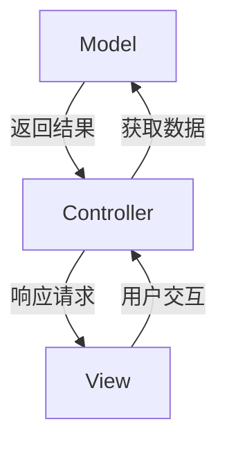
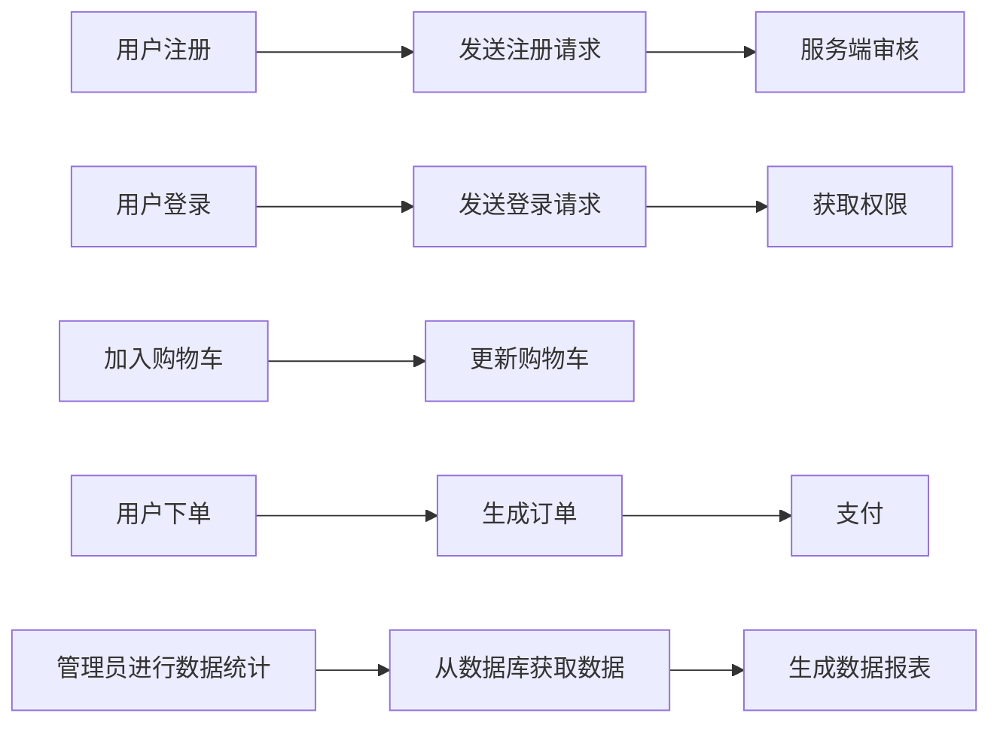

# 关于微商系统的项目报告（二）

## 一、项目需求的进一步理解和描述
该项目是针对一个特定商家的用于服务客户和管理库存的小型产品开发项目。

从角色角度：
1. **客户端**：为买家提供服务
2. **服务端**：处理各种请求的中转站和管理员（商家）操作的接口

从对象角度：
1. **客户管理**：客户信息维护、购买历史、会员机制、交互处理
2. **商品管理**：支持商品上架、下架、搜索、库存更新
4. **推送通知**：操作通知、系统通知
3. **订单管理**：购物车、支付结算、订单与购买历史、优惠折扣
4. **数据统计**：商品流动、利润统计

## 二、相关技术讨论

### （1）C/S结构和B/S结构
- C/S结构：用户需要安装客户端软件
- B/S结构：用户不需安装软件，直接通过浏览器访问

### （2）MVC框架
Model（模型）、View（视图）、Controller（控制）三者相互关联构成的软件设计框架。如下图：

### （3）持久层
数据库层，用SQLite轻量化语言维护

### （4）设计模式
- 工厂模式：创建对象，使用频率高
- 策略模式：服务器将请求根据方法、路由、请求头等发放给不同处理器
- 观察者模式：为模型附加观察者进行事件通知
- 单例模式：Client类和Server类具有全局单例，保持一个连接不断开

### （5）Web服务
- 前端：采用HTML、Vue技术
- 后端：由服务器软件同一处理

### （6）并发和互斥
针对两个用户同时操作，由于预计服务端处理请求的时间不会很长，采用同步通信足以应对。发送请求后会阻塞进程约0.1秒，期间用户不可再发送请求，超时即认为响应失败。

### （7）JavaEE、JSP、JavaScript
- 后端：JavaEE技术栈（Spring Boot + Spring MVC + MyBatis）
- 前端：Vue.js框架 + Element UI组件库
- 模板引擎：Thymeleaf（替代JSP）

### （8）同步和异步通信
- 同步通信：等待响应并阻塞进程，处理普通业务
- 异步通信：消息队列处理耗时操作（较少）

## 三、前端和后端概要设计

### （1）模块划分
**后端模块**：
- 用户信息
- 商品管理
- 订单处理
- 购物车
- 推送通知
- 数据统计

**前端模块**：
- 登录注册
- 商品浏览
- 购物车
- 订单
- 个人中心
- 通知

### （2）UI设计
基于Qt自带的GUI进行设计
- 色彩方案：现代黑色主题，体现专业和简洁
- 布局：左侧导航、顶部菜单的主题结构
- 交互：使用Qt原生控件

### （3）主要类的划分
**后端**：
- UserController（用户）
- GoodsController（商品）
- OrderController（订单）
- CartController（购物车）
- NotificationController（通知）
- StatisticsController（数据统计）

**前端**：
- Login（登录）
- GoodsList（商品列表）
- Cart（购物车）
- Order（订单）
- UserCenter（用户中心）
- Notification（通知）

### （4）数据库设计
主要表结构：
- 用户表（user）：
  - id
  - account
  - password
  - role
- 商品表（goods）：
  - id
  - name
  - description
  - price
  - stock
  - category
- 订单表（order）：
  - id
  - user_id
  - total_amount
  - total_price
  - status
  - create_time
  - order_item
- 订单项表（order_item）：
  - id
  - order_id
  - goods_id
  - quantity
  - price
- 购物车表（cart）：
  - id
  - user_id
  - goods_id
  - quantity

### （5）通信协议设计
- 采用TCP协议
- 请求结构：请求头（headers）、请求体（body）
- 响应结构：响应头（headers）、响应体（body）
- 发送请求需提供请求方法（mothod）、路由（route）、请求头、请求体
- 发送响应需提供响应头、响应体

### （6）主要逻辑流程图

## 四、其他考虑
该产品将商家和管理员的职责混在一起，而实际情况是，买家和商家同属于平台用户，管理员具有最高权限，明显这样的项目只能用于一个店铺。若需要扩展，需要对项目进行重构。