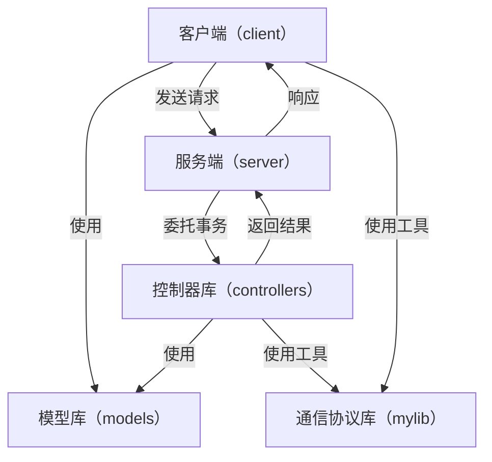
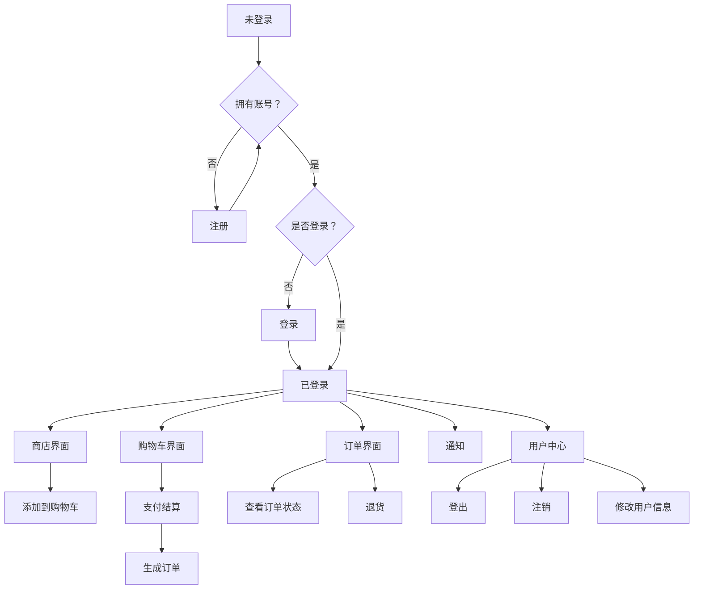
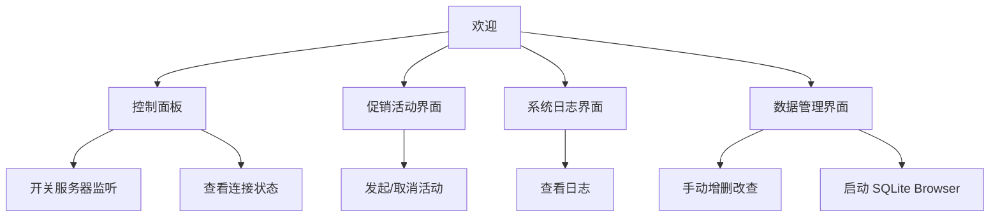

# 一、前端和后端详细设计，包括：
  
## （1）模块划分及模块间的关系


## （2）UI流程设计

### 客户端：



### 服务端（无需登录）：



## （3）类的设计及说明

坚持在一个模块中以一个类为根，统领其他类，形成一棵庞大、有序、层次清晰的类树。具体设计如下： 

```
 客户端模块
	MainWindow (root)
		ShopWindow
		CartWindow
			PaymentDialog
		OrderWindow
		NotificationWindow
		UserCenterWindow
			LoginDialog
			RegisterDialog
服务端模块
	MainWindow (root)
		ControlWindow
		PromotionWindow
		LogWindow
		DatabaseWindow
控制器模块
	ControllerFactory (root)
		Controller (virtual class)
			LoginController
			RegisterController
			UnregisterController
			UserController
			ShopController
			OrderController
			NotificationController
模型模块
	(no root)
	User
	Goods
	Cart
	CartItem
	Order
	OrderItem
通信协议模块
	(no root)
	Request
	Response
	TcpClient
	TcpServer
```

## （4）数据库详细设计及说明

数据库列表（使用rowid表示一条记录的ID）：

```
用户（users）
	用户名（TEXT）
	密码（TEXT）
	是否激活（BOOLEAN）
商品（goods）
	货名（TEXT）
	描述（TEXT）
	价格（REAL）
	存量（INTEGER）
	类型（TEXT）
购物车（carts）
	用户ID（INTEGER）
	购物车项ID列表（JSON）
购物车项（cart_items）
	购物车ID（INTEGER）
	商品ID（INTEGER）
	商品数量（INTEGER）
订单（orders）
	用户ID（INTEGER）
	消费（REAL）
	创建时间（DATETIME）
	状态（TEXT）
	订单项ID列表（JSON）
订单项（order_items）
	订单ID（INTEGER）
	商品ID（INTEGER）
	商品数量（INTEGER）
	总价（REAL）
```
## （5）通信协议详细设计

自行设计类HTTP协议，借用了状态码、请求头、请求体、路由等元素。另外参考了这位大神的设计：[yhirose/cpp-httplib: A C++ header-only HTTP/HTTPS server and client library](https://github.com/yhirose/cpp-httplib)。具体设计如下：

```
请求（request）：
	请求方法（method）（目前仅支持POST方法）
	路由（route）（标识不同的请求及调用的服务）
	请求头（headers）
	请求体（body）（包含具体业务数据）
响应（response）：
	状态码（status）（包含主要的HTTP状态码）
	请求头（headers）
	请求体（body）
	错误信息（error）
```
# 二、对于技术的迭代和架构的迭代的说明；（即：和概要设计比有无推翻或者修改）

- 技术的迭代是指在架构和核心设计基本不变的前提下，对实现这些设计所采用的具体技术组件、工具、库、框架或语言版本进行升级或替换，通常不会推翻或修改概要设计。
- 而架构的迭代是指对系统的高层次结构、组成原则、组件关系和数据流动进行重大的、甚至根本性的调整和改变，它几乎总是会推翻原来的概要设计。
# 三、你的计划及计划实现的偏差情况说明

- 通信方式：原计划采用异步通信，目前出于实现的复杂性考虑，改用同步通信。虽然在一定程度上会造成阻塞进程的问题，但对于控制器处理的速度来说可以接受。后续加入加载图片功能时，为解决通信延时的阻塞问题，需要采用异步。
- 预测模型：原计划实现分析用户行为等数据预测模型，目前进度刚处于打好地基的阶段，可能没有时间和精力完成这个较为复杂的功能。
# 四、你现在完全掌握的部分和困难的部分都是什么

- 完全掌握的部分：完成了通信协议的设计，实现了各种模型和工具，构建了前后端对接的技术支持，为搭建整个软件系统奠定了基础。
- 困难的部分：具体业务逻辑的分析和实现，如UI界面和功能的填充，以及开发进度的担忧。